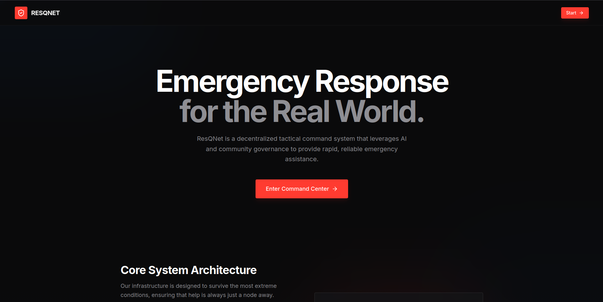
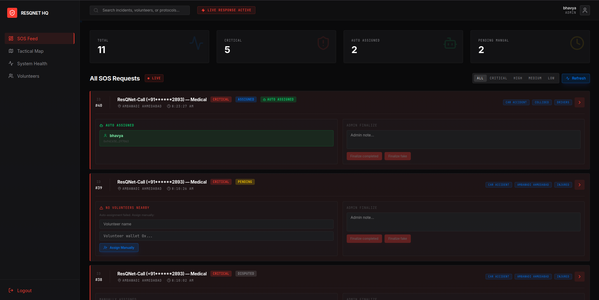
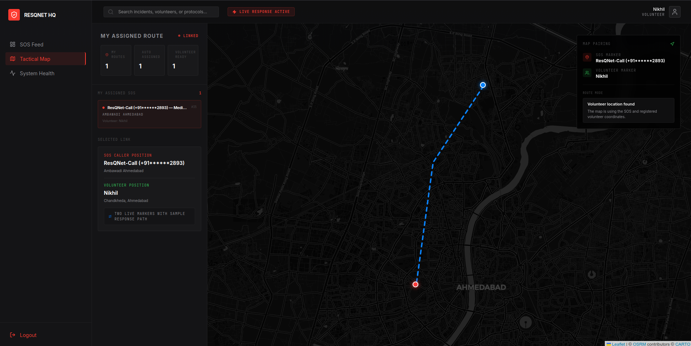

<div align="center">
  <h1>ResQNet</h1>
  <p><em>AI-Powered, Blockchain-Verified Emergency Response & Volunteer Coordination System</em></p>
  
  
  
  
  
  
  
</div>

---

## 📑 Table of Contents
- [Project Overview](#-project-overview)
- [Key Features](#-key-features)
- [System Architecture](#-system-architecture)
- [Tech Stack](#-tech-stack)
- [Project Structure](#-project-structure)
- [Getting Started](#-getting-started)
- [API Endpoints](#-api-endpoints)
- [Blockchain & Smart Contracts](#-blockchain--smart-contracts)
- [How It Works — End to End Flow](#-how-it-works--end-to-end-flow)
- [Screenshots](#-screenshots)
- [Contributing](#-contributing)
- [Team](#-team)
- [License](#-license)

---

## 📖 Project Overview
**ResQNet** is a next-generation emergency response system that bridges the gap between distressed individuals, local volunteers, and official dispatchers. By integrating Artificial Intelligence, real-time geocoding, and Blockchain technology, ResQNet eliminates the inefficiencies of traditional manual dispatch systems.

### **Why ResQNet?**
Unlike existing 911/SOS systems that rely purely on manual operator routing, ResQNet:
1. **Understands Human Panic:** Uses AI voice transcription and NLP to extract key details from distressed callers instantly.
2. **Prioritizes Intelligently:** Uses Machine Learning to score the credibility and priority of the request, filtering out spam.
3. **Dispatches Instantly:** Automatically assigns the nearest available volunteer using Haversine distance formulas based on real-time geocoding.
4. **Ensures Accountability:** Writes all SOS request milestones to an Ethereum smart contract, guaranteeing transparency, preventing data tampering, and rewarding successful volunteer rescues with cryptocurrency micro-transactions.

---

## ✨ Key Features
- 📞 **AI-Powered Voice Call SOS:** Integration with Twilio and OpenAI Whisper transcribes emergency phone calls in real-time.
- 🧠 **Smart NLP & ML Scoring:** Google Gemini extracts location, keywords, and summary, while local Scikit-Learn ML models score the priority and credibility of the caller.
- 📍 **Automatic Volunteer Assignment:** Calculates the Haversine distance to find and assign the nearest active volunteer instantly upon SOS creation.
- 🗺️ **Intelligent Geocoding:** Automatically converts rough text locations (e.g., "near the petrol pump") into precise lat/long coordinates using Nominatim fallback logic.
- ⛓️ **Blockchain-Verified Records:** Every state change (Created, Assigned, Volunteer Reported, Completed) is permanently logged on the Ethereum Sepolia network.
- 💰 **ETH Micro-Rewards:** Volunteers are financially incentivized for verified rescues with automatic ETH payouts executed via smart contracts.
- 📊 **Real-Time Admin Dashboard:** A sleek, tactical map interface for admins to monitor live SOS requests, system health, and volunteer locations.
- 🔐 **Role-Based Access Control:** Distinct interfaces and permissions for Users, Volunteers, and Admins.
- 🛡️ **Volunteer Verification Workflow:** A multi-step verification process where volunteers report completion on the ground, and admins finalize the record to prevent fraud.

---

## 🏗 System Architecture

```text
  [Distressed User] 
        │
   (Phone Call)
        â–¼
 ┌──────────────────────────────────────┐
 │         twilio + resqnet-call        │
 │  (FastAPI, Whisper, Gemini, ML)      │
 └──────────────────┬───────────────────┘
                    │ (JSON Payload: Priority, Location, Transcript)
                    â–¼
 ┌──────────────────────────────────────┐       ┌────────────────────┐
 │             Backend API              │ ────► │ MongoDB (Mongoose) │
 │     (Express.js, Ethers.js, Node)    │       │ (Users, SOS, Vols) │
 └─────────┬──────────────────┬─────────┘       └────────────────────┘
           │                  │
    (Auto-Assigns Nearest)    │ (Writes Tx)
           â–¼                  â–¼
 ┌──────────────────┐ ┌──────────────────────────────────────────┐
 │   path Engine    │ │        Smart Contract (Ethereum)         │
 │     (OSRM)       │ │      (Logging, ETH Mcro-Rewards)         │
 └──────────────────┘ └──────────────────────────────────────────┘
           â–²
           │ (WebSocket / API Polling)
           â–¼
 ┌──────────────────────────────────────┐
 │        new-frontend (React)          │
 │   (Admin Dashboard, Tactical Map)    │
 └──────────────────────────────────────┘
```

---

## 💻 Tech Stack

| Category | Technology | Purpose |
| :--- | :--- | :--- |
| **Frontend** | React, TypeScript, Vite, TailwindCSS | High-performance, tactical UI dashboard and component rendering |
| **Backend** | Node.js, Express, Mongoose | REST API handling, geospatial queries ($near), system orchestration |
| **Database** | MongoDB | Persistent storage for users, volunteers, and application state |
| **Blockchain** | Solidity, Ethers.js, Hardhat | Smart contract deployment and interaction on the Sepolia testnet |
| **AI / NLP** | Google Gemini (2.5 Flash), Scikit-Learn | Context extraction, emergency categorization, and priority ML scoring |
| **Voice / Speech** | Twilio, OpenAI Whisper | Handles incoming voice calls and converts speech-to-text |
| **Geocoding & Maps**| OpenStreetMap (Nominatim), Leaflet | Translating textual locations to coords, rendering the frontend Tactical Map |

---

## 📁 Project Structure

```text
GlyphCoders/
├── backend/            # Express.js API, MongoDB models, assignment logic, blockchain sync
├── contracts/          # Solidity smart contracts (ResQNetProtocol.sol)
├── new-frontend/       # React + Vite application (Admin Dashboard, SOS Feed, Tactical Map)
├── resqnet-call/       # Python FastAPI service for Twilio call handling & ML/AI inference
├── scripts/            # Hardhat deployment and verification scripts (deploy.js, verify.js)
├── test/               # Smart contract test suites (TBD)
├── hardhat.config.js   # Configuration for Ethereum network and contract deployment
└── package.json        # Main project manifest with cross-workspace npm scripts
```

---

## 🚀 Getting Started

### Prerequisites
- Node.js (v18+)
- Python (v3.10+)
- MongoDB Atlas (or local instance)
- Twilio Account (for voice calls)
- Google Gemini API Key
- MetaMask Wallet with Sepolia Test ETH

### Step 1: Installation
Clone the repository and install dependencies across all services:

```bash
git clone https://github.com/yourusername/GlyphCoders.git
cd GlyphCoders

# Install Root (Hardhat) dependencies
npm install

# Install Backend dependencies
cd backend && npm install

# Install Frontend dependencies
cd ../new-frontend && npm install

# Install Python requirements for Call/AI Service
cd ../resqnet-call
python -m venv .venv
source .venv/bin/activate  # On Windows: .venv\Scripts\activate
pip install -r requirements.txt
```

### Step 2: Environment Variables
Create `.env` files in the respective directories based on the `.env.example` templates provided.

**Root `.env` (Hardhat)**
```env
RPC_URL=your_alchemy_or_infura_sepolia_rpc_url
PRIVATE_KEY=your_metamask_private_key
ETHERSCAN_API_KEY=api_key_for_contract_verification
```

**`backend/.env`**
```env
PORT=5000
MONGO_URI=mongodb+srv://<user>:<password>@cluster.mongodb.net/resqnet
CLIENT_URL=http://localhost:5173
RPC_URL=your_sepolia_rpc_url
PRIVATE_KEY=your_metamask_private_key
CONTRACT_ADDRESS=address_of_deployed_contract
TWILIO_FROM_NUMBER=+1234567890
TWILIO_MESSAGING_SERVICE_SID=optional_sms_sid
```

**`new-frontend/.env`**
```env
VITE_API_URL=http://localhost:5000
GEMINI_API_KEY=your_gemini_api_key
APP_URL=http://localhost:5173
```

**`resqnet-call/.env`**
```env
GEMINI_API_KEY=your_gemini_api_key
# Settings for Twilio and FastAPI webhooks
```

### Step 3: Running Locally

You'll need separate terminal windows to run the full stack:

**1. Start the Backend:**
```bash
cd backend
npm run dev
```

**2. Start the Frontend:**
```bash
cd new-frontend
npm run dev
```

**3. Start the Voice/AI Handler:**
```bash
cd resqnet-call
uvicorn main:app --reload --port 8000
# Note: You will need ngrok to expose port 8000 if you want to test live Twilio calls.
```

### Step 4: Deploying Smart Contracts
If you wish to deploy your own instance of the ResQNetProtocol:
```bash
# From the root directory
npx hardhat run scripts/deploy.js --network sepolia
```
*Copy the resulting contract address into your `backend/.env`.*

---

## 🔌 API Endpoints
*Note: A complete Postman collection is TBD. Here are the core exposed endpoints handled by the Express backend.*

| Method | Route | Description | Auth Required |
| :--- | :--- | :--- | :--- |
| `GET` | `/api/health` | System health check (DB + Blockchain connection status) | No |
| `GET` | `/api/sos` | List all SOS complaints (sorted by newest) | Yes (Admin/Vol) |
| `POST` | `/api/sos` | Create a new SOS record manually or via `resqnet-call` | No |
| `PUT` | `/api/sos/:id/assign` | Manually assign a volunteer to an SOS | Yes (Admin) |
| `GET` | `/api/sos/:id/assignment` | Get rich assignment details and volunteer distance | Yes |
| `PUT` | `/api/sos/:id/volunteer-confirm` | Volunteer marks the operation as complete on-ground | Yes (Volunteer) |
| `PUT` | `/api/sos/:id/admin-confirm` | Admin finalizes record and triggers ETH payout | Yes (Admin) |
| `POST` | `/api/volunteers` | Register a new volunteer with their Ethereum wallet | No |
| `GET` | `/api/volunteers` | List all available registered volunteers | Yes (Admin) |
| `GET` | `/api/web3/status` | Check the ResQNetProtocol contract variables | No |
| `GET` | `/api/web3/reputation/:wallet`| Fetch the resolved reputation score of a volunteer | No |

---

## ⛓️ Blockchain & Smart Contracts

The `ResQNetProtocol.sol` smart contract acts as an immutable ledger and escrow for the system.
- **Auditable Lifecycle:** When an SOS is created, assigned, updated by a volunteer, and finalized, a transaction is written to the blockchain containing a hash of the operation.
- **Financial Incentivization:** Upon successful confirmation of an emergency resolution by an Admin, the smart contract automatically transfers a predefined amount of ETH (`rewardAmount`) to the Volunteer's registered wallet.
- **Verification:** Users can independently verify the `completedTxHash` through Etherscan to guarantee that response times and records have not been altered in the central database.
- **Network:** Currently deployed on the Ethereum **Sepolia Testnet**.

---

## 🔄 How It Works — End to End Flow

1. **The Emergency Occurs:** A user urgently dials the Twilio ResQNet number. 
2. **AI Processing:** The `resqnet-call` engine engages. The caller speaks, Whisper transcribes the speech, and Gemini identifies the situation (e.g., "Fire at Alkapuri"). The local ML model cross-checks the transcript to assign a high 'Credibility' and 'Critical' priority score.
3. **Dispatch:** The Python service sends JSON to the Express Backend.
4. **Geocoding & Auto-Assignment:** The backend silently translates the text location into exact `[lat, lng]` coordinates. The system runs a geospatial query, calculates the Haversine distance, and assigns the SOS to the nearest available registered volunteer. An SMS is immediately dispatched to the volunteer.
5. **Blockchain Logging:** The Express Backend calls the `createSOS` and `assignVolunteer` functions on the Sepolia smart contract.
6. **Resolution:** The volunteer arrives at the scene, resolves the issue, and reports "Completed" via their user interface.
7. **Settlement:** The Admin reviews the volunteer's field notes on the Tactical Dashboard and clicks "Finalize Completed". The smart contract increments the Volunteer's reputation and transfers ETH micro-rewards directly to their MetaMask wallet. The volunteer is released back into the available pool.

## 🖼 Screenshots

*Landing Page with Project Overview*


*Tactical Dashboard showing live SOS Feeds and ML confidence metrics*


*Detailed view of an individual SOS with map*


---

## 🤝 Contributing
Contributions make the open-source community an amazing place to learn, inspire, and create.
1. Fork the Project
2. Create your Feature Branch (`git checkout -b feature/AmazingFeature`)
3. Commit your Changes (`git commit -m 'Add some AmazingFeature'`)
4. Push to the Branch (`git push origin feature/AmazingFeature`)
5. Open a Pull Request

---

## 👥 Team

| Name | Role | GitHub |
| :--- | :--- | :--- |
| **Name TBD** | Full-Stack Developer | [Link](#) |
| **Name TBD** | AI/ML Engineer | [Link](#) |
| **Name TBD** | Blockchain Specialist| [Link](#) |

---

## 📄 License
This project is licensed under the MIT License - see the `LICENSE` (or `package.json`) file for details.
